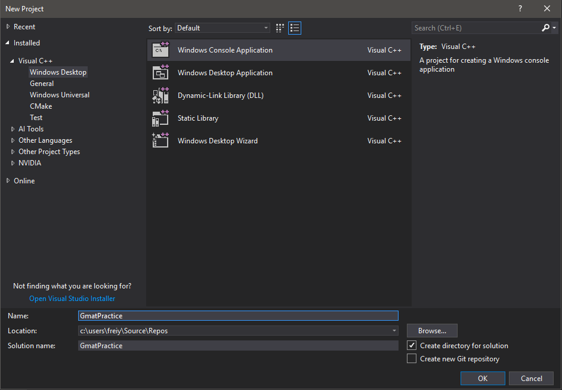
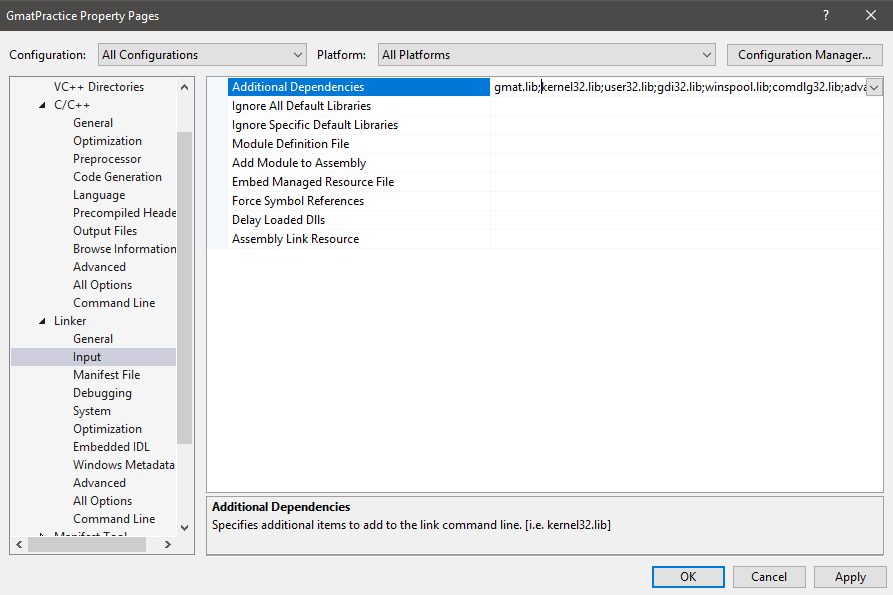
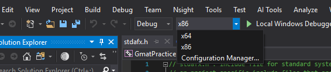
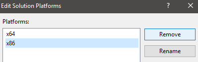

# Gmat

Matrix operations using CUDA


# Contents

1. [Overview](#overview)
2. [Tutorial](#tutorial)
3. [API](#api)

# Overview

## C++

```c++
#include <iostream>
#include <gmat.h>

using namespace std;

int main()
{
	try
    {	
        // {{ 6, 8, 10, }}
        cout << gmat({ { 1, 2, 3 } }) + gmat({ { 5, 6, 7 } }) << endl;
        // {{ -6, -4, -2, }}
        cout << gmat({ { 1, 2, 3 } }) - gmat({ { 7, 6, 5 } }) << endl;
        // {{ 5, 12, 21, }}
        cout << gmat({ { 1, 2, 3 } }) * gmat({ { 5, 6, 7 } }) << endl;
        // {{ 0.2, 0.333333, 0.428571, }}
        cout << gmat({ { 1, 2, 3 } }) / gmat({ { 5, 6, 7 } }) << endl;
        // {{ 14, 16, 18, },
        // { 31.6, 36.8, 42, },
        // { 49.2, 57.6, 66, },
        // { 66.8, 78.4, 90, }}
        cout << gmat({
            { 1, 2, 3, 4, },
            { 5, 6, 7, 8, },
            { 9, 10, 11, 12, },
            { 13, 14, 15, 16, },
        }) % gmat({
            { 1, 2, 3, },
            { 4, 5, 6, },
            { 7, 8, 9, },
            { 10, 11, 12, },
        }) / 5.0 << endl;
    }
    catch (const gmat_exception & ex)
    {
        cout << "Exception: " << ex.what() << endl;
    }
    return 0;
}
```

## C

```c
#include <stdio.h>
#include <gmat.h>

#include <stdio.h>
#include <gmat.h>

const float data[4][4] = {
	{ 1, 2, 3, 4, },
	{ 5, 6, 7, 8, },
	{ 9, 10, 11, 12, },
	{ 13, 14, 15, 16, },
};
float dres[4][4];

void print()
{
	putc('{', stdout);
	for (int i = 0; i < 4; i++)
	{
		putc('{', stdout);
		putc(' ', stdout);
		for (int j = 0; j < 4; j++)
			printf("%g, ", dres[i][j]);
		putc('}', stdout);
		if (i != 3)
			puts(",");
	}
	puts("}", stdout);
}

#define CHECK_GMAT(exp, msg) if((exp) != gmat_success) { puts(msg); rtn = 1; goto destroy; }

int main()
{
	gmat mat0, mat1, res;
	int rtn = 0;
	
	CHECK_GMAT(gmat_create(&mat0, 4, 4, 0), "Failed to initialize mat0.");
	CHECK_GMAT(gmat_create(&mat1, 4, 4, 0), "Failed to initialize mat1.");
	CHECK_GMAT(gmat_create(&res, 4, 4, 0), "Failed to initialize res.");
	
	CHECK_GMAT(gmat_copy_from(&mat0, data), "Failed to copy data.");
	CHECK_GMAT(gmat_copy_from(&mat1, data), "Failed to copy data.");
	
	CHECK_GMAT(gmat_product(&res, &mat0, &mat1), "Operation failed.");
	CHECK_GMAT(gmat_copy_to(&res, dres), "Failed to get the result.");

    // {{ 90, 100, 110, 120, },
	// { 202, 228, 254, 280, },
	// { 314, 356, 398, 440, },
	// { 426, 484, 542, 600, }}
	print();

destroy:
	gmat_destroy(&mat0);
	gmat_destroy(&mat1);
	gmat_destroy(&res);
	return 0;
}
```


# Tutorial

## System Requirements

* x86-64 based Windows PC
* CUDA-capable NVIDIA GPU
* Visual Studio 2015 or 2017

## Files

Download file from [link](https://github.com/paxbun/gmat/releases). After download, you will have 5 files:


* GMAT.dll: 
* GMAT.lib: 
* gmat.h: 
* gmat.inl: 
* gmatc.inl:

## Create a new project

Open visual studio, and create a new C++ Windows Console Application project by choosing [File] > [New] > [Project]. Name it **GmatPractice**.



## Get the project ready

Right-click the project **GmatPracice** at [Solution Explorer], and choose [Properties]. Select [C/C++] > [General] and type the path of the folder where you downloaded the files in [Additional Include Directories]. Select [Linker] > [General], and type the same path in [Additional Library Directories].


Select [Linker] > [Input], and type "gmat.lib" in [Additional Dependencies].



Click [OK] to save the changes.

## Manage Configuration

Since Gmat does not support x86, your first Gmat program should be based on x64. Select [x86] > [Configuration manager].



Select [Active Solution platform] > [x86] > [Edit...].


Remove [x86].



## Create your first Gmat program

Now you are ready to create your first gmat program.


# API